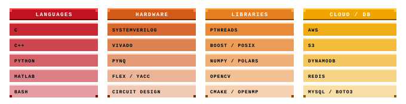

# Archie Kendall

---

## About Me

- Studying Electronics and Computer Engineering at `Imperial College London`
- Industry experience:
  - RF Electronic Engineering and Signal Analysis at `ETL Systems`
  - Aerospace Electronics, Control and Hydrogen Engineering at `GKN Aerospace`

**Currently building:**
- `ComPilates: A Flexible C Compiler`: Full pipeline from lexer to RISC-V codegen
    - using C++, Yacc, Flex
- `PYNQcast: An FPGA-Accelerated Raycasting Game Engine`
   - Multiplayer/Node Raycasting on FPGA using PYNQ dev-board
   - Staged async server and database-backed telemetry & development engine

#### Interests:
FPGAs · Embedded Systems · RTL Design · Energy Storage Systems · Data Analytics · Computer Vision · Control Theory · Computer Architecture · Performance Engineering · Signal Processing · Data Engineering

---

## Tech Stacks

  

>

---

## Contribution Graph

  

---
